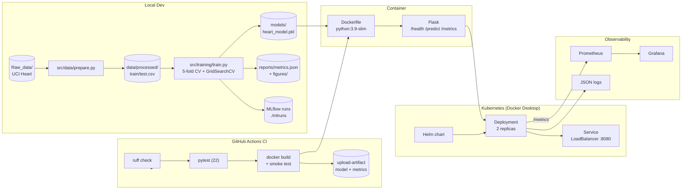

# Heart Disease UCI — End-to-End MLOps Pipeline

Production-ready ML pipeline for the **UCI Heart Disease** binary classification
task, built end-to-end: EDA → preprocessing → training (CV + hyperparameter
tuning) → MLflow tracking → Flask API → Docker → CI/CD → Kubernetes (Helm)
→ Prometheus + Grafana monitoring.

| | |
|---|---|
| **Repo** | `2025cs05011-nagenkri-bits/mlops-heart-disease` |
| **Best model** | Logistic Regression (`C=1.0`) — test ROC-AUC **0.958**, CV ROC-AUC **0.907 ± 0.018** |
| **Container image** | `heart-disease-api:v2` (multi-stage, `python:3.9-slim`) |
| **API endpoints** | `GET /health`, `POST /predict`, `GET /metrics` |
| **Cluster** | Docker Desktop Kubernetes (local) — Helm chart `helm/heart-disease-api` |
| **Observability** | `kube-prometheus-stack` + `grafana` Helm charts, custom dashboard |

---

## Architecture



---

## Repository Layout

```
.
├── .github/workflows/ci.yml            # CI pipeline (lint, test, build, artifacts)
├── Mlops_Assignment1.pdf               # Assignment brief
├── README.md                           # This file
└── DMML_Evidently_Demo/
    ├── Raw_data/heart+disease/         # UCI dataset (committed)
    ├── data/processed/                 # train.csv / test.csv
    ├── notebooks/01_eda.ipynb          # Exploratory Data Analysis
    ├── src/
    │   ├── data/{prepare,preprocess}.py
    │   ├── training/train.py           # CV + GridSearchCV
    │   ├── evaluation/                 # metrics helpers
    │   ├── monitoring/drift.py         # Evidently AI helpers (profile + drift)
    │   └── serving/app.py              # Flask + Prometheus instrumentation
    ├── tests/                          # 29 pytest cases
    ├── models/heart_model.pkl          # trained sklearn Pipeline
    ├── reports/
    │   ├── metrics.json                # final test + CV metrics
    │   ├── figures/                    # EDA plots
    │   ├── evidently/                  # data profile + drift HTML/JSON reports
    │   ├── screenshots/{k8s,monitoring}/   # demo screenshots
    │   └── Final_Report.docx           # 10-page report
    ├── data/reference/                 # frozen training-set snapshots for drift baselines (committed)
    ├── data/demo/                      # generated drift-demo CSVs (gitignored)
    ├── Dockerfile
    ├── k8s/                            # raw manifests (deploy/svc/cm/ns/ingress)
    ├── helm/heart-disease-api/         # Helm chart
    ├── monitoring/                     # Prometheus + Grafana values + dashboard CM
    └── scripts/                        # setup / cleanup / traffic_simulator / run_evidently / generate_drift_demo / freeze_reference
```

---

## Dataset

The Cleveland Heart Disease dataset (UCI ML Repository, ID 45) is **already
committed** to `DMML_Evidently_Demo/Raw_data/heart+disease/`, so reproducing
the pipeline requires no external download.

If you ever need to re-fetch from the upstream archive, use the helper script:

```bash
cd DMML_Evidently_Demo
./scripts/download_data.sh           # idempotent; skips if data present
./scripts/download_data.sh --force   # force re-download
```

Equivalent manual steps:

```bash
cd DMML_Evidently_Demo/Raw_data
curl -L -o heart-disease.zip \
    https://archive.ics.uci.edu/static/public/45/heart+disease.zip
unzip -o heart-disease.zip -d heart+disease
rm heart-disease.zip
```

The cleaned 80/20 train/test split is regenerated deterministically by
`python -m src.data.prepare` (random seed 42).

---

## Quick Start (local)

```bash
# 1. Setup
cd DMML_Evidently_Demo
python3.9 -m venv venv && source venv/bin/activate
pip install -r requirements.txt -r requirements-dev.txt

# 2. Train (regenerates data splits, runs CV+GridSearchCV, writes pkl + metrics)
python -m src.data.prepare
python -m src.training.train

# 3. Tests
pytest tests/ -v          # 22 passed

# 4. Run API locally (no Docker)
python -m src.serving.app # http://localhost:8080
```

### Sample request

```bash
curl -X POST http://localhost:8080/predict \
  -H "Content-Type: application/json" \
  -d '{"age":67,"sex":1,"cp":4,"trestbps":160,"chol":286,"fbs":0,
       "restecg":2,"thalach":108,"exang":1,"oldpeak":1.5,"slope":2,
       "ca":3,"thal":7}'
# {"prediction":1,"probability":0.93,"label":"disease"}
```

---

## Docker

```bash
cd DMML_Evidently_Demo
docker build -t heart-disease-api:v2 .
docker run -p 8080:8080 heart-disease-api:v2
```

The image is a multi-stage `python:3.9-slim` build (~180 MB). Health-check
script in the image polls `/health` for liveness/readiness.


---

## Kubernetes (Docker Desktop)

Enable Kubernetes in Docker Desktop, then:

```bash
cd DMML_Evidently_Demo
./scripts/setup_local_k8s.sh         # creates ns, builds image, helm install
kubectl -n heart-disease get all
curl http://localhost:8080/health
```

To upgrade after a code change:

```bash
docker build -t heart-disease-api:v2 .
helm upgrade heart-disease helm/heart-disease-api -n heart-disease \
  --set image.tag=v2
kubectl -n heart-disease rollout restart deploy/heart-disease-api
```

Tear down: `./scripts/cleanup_local_k8s.sh`

---

## Monitoring (Prometheus + Grafana)

```bash
cd DMML_Evidently_Demo
./scripts/setup_monitoring.sh        # installs both via helm in ns 'monitoring'

# Port-forward
kubectl -n monitoring port-forward svc/prometheus-server 9090:80 &
kubectl -n monitoring port-forward svc/grafana 3000:80 &

# UIs
open http://localhost:9090           # Prometheus
open http://localhost:3000           # Grafana (admin / admin)
```

Generate steady traffic for the Grafana panels (the `rate()` queries need
≥ 4 samples in their `[2m]` window):

```bash
./scripts/traffic_simulator.sh start         # nohup-backed, ~1.5 req/s
./scripts/traffic_simulator.sh status        # see last 5 cycles
./scripts/traffic_simulator.sh stop
```

The Grafana dashboard `Heart Disease > Heart Disease API` is auto-loaded via
`monitoring/dashboard-configmap.yaml` and shows: model loaded per pod,
total predictions, HTTP request rate, P95 latency, prediction rate by class,
and HTTP status codes.

Tear down: `./scripts/cleanup_monitoring.sh`

---

## Data profiling & drift detection (Evidently AI)

Offline data-quality and distribution-shift checks built on top of
[Evidently AI](https://www.evidentlyai.com/). Reports cover a single
dataset (`DataQualityPreset`) and a reference-vs-current comparison
(`DataDriftPreset` + `TargetDriftPreset`).

### Frozen reference snapshot

The drift gate compares against an immutable, version-tagged copy of
the training set the production model was built on, committed under
`data/reference/`:

```
data/reference/
├── reference_train_v1.0.0.csv             # frozen training distribution
└── reference_train_v1.0.0.metadata.json   # version, sha256, git commit, schema, prevalence
```

The snapshot is produced once via:

```bash
cd DMML_Evidently_Demo
python scripts/freeze_reference.py --version v1.0.0
# bump --version every time the production model is retrained on a new dataset
```

Both files are tracked in git so every CI run, every developer, and
every drift report uses the exact same baseline. The metadata file
makes the snapshot fully traceable (which commit produced it, what
schema, what target prevalence, file hash).

### Running the gate

```bash
cd DMML_Evidently_Demo

# 1. Default: frozen v1.0.0 reference vs today's regenerated train.csv
#    Catches changes to the raw data file or to src/data/prepare.py.
python scripts/run_evidently.py
# -> reports/evidently/profile_<ts>.html
# -> reports/evidently/drift_<ts>.html
# -> reports/evidently/drift_summary.json
# -> exit 0 (no drift expected on a clean checkout)

# 2. Generate two demo "current" datasets (healthy + synthetically drifted)
python scripts/generate_drift_demo.py

# 3. Healthy current -> exit 0
python scripts/run_evidently.py --current data/demo/current_healthy.csv

# 4. Drifted current -> exit 1, fails the CI gate
python scripts/run_evidently.py --current data/demo/current_drifted.csv

# 5. Override the gate (still produces the report, doesn't block):
python scripts/run_evidently.py --current data/demo/current_drifted.csv \
                                --no-fail-on-drift

# 6. Production-style usage: compare against a fresh data dump
python scripts/run_evidently.py \
  --reference data/reference/reference_train_v1.0.0.csv \
  --current   data/incoming/prod_sample_$(date +%F).csv
```

The script exits non-zero whenever Evidently flags
`dataset_drift=True` (default threshold: ≥ 50 % of columns drifted), so
the same command both produces the human-readable HTML and gates the
CI pipeline. See `src/monitoring/drift.py` for the reusable helpers
and `scripts/freeze_reference.py` for the snapshot tooling.

---

## CI/CD

`.github/workflows/ci.yml` runs on every push/PR to `main`:

| Job | Steps |
|---|---|
| **test** | checkout → setup-python 3.9 → install deps → **ruff check** → regenerate splits → train model → **pytest** (29) → **Evidently** profile + drift gate → **upload-artifact** (`heart_model.pkl`, `metrics.json`, `figures/`, `evidently/`) |
| **docker** (needs test) | checkout → build model → `docker build` → `docker run -d` → curl `/health` and `/predict` smoke test |

Artifacts are retained for 14 days under the run.

---

## Results

Final selection: **Logistic Regression** (highest test ROC-AUC). Both
candidates were tuned with `GridSearchCV` over a 5-fold `StratifiedKFold` on
the training set; selection metric is test-set ROC-AUC.

| Model | Best params | CV ROC-AUC | Test ROC-AUC | Test F1 | Test Accuracy |
|---|---|---|---|---|---|
| **Logistic Regression** ⭐ | `C=1.0` | 0.907 ± 0.018 | **0.958** | 0.867 | 0.869 |
| Random Forest | `n_estimators=100, max_depth=None` | 0.895 ± 0.026 | 0.945 | 0.900 | 0.902 |

Full per-class precision/recall and confusion matrices are in
`DMML_Evidently_Demo/reports/metrics.json`.

EDA figures live in `DMML_Evidently_Demo/reports/figures/`:
`class_balance.png`, `feature_histograms.png`, `boxplots_by_target.png`,
`correlation_heatmap.png`.

---

## Screenshots (demo evidence)

| Folder | What it proves |
|---|---|
| `reports/screenshots/k8s/` (10 files) | Cluster nodes, kubectl get all + LoadBalancer, Helm release, deployment describe, pod logs, curl endpoints, browser form, file tree, Docker Desktop |
| `reports/screenshots/monitoring/` (10 files) | `/metrics` endpoint, monitoring pods, Prometheus targets/queries/rate, Grafana login + dashboard + panel zoom, pod logs, full test suite |

---

## Reproducibility

* Pinned dependencies (`requirements.txt`, `requirements-dev.txt`).
* Deterministic train/test split (seed `42` in `src/data/prepare.py`).
* Deterministic CV (seed `42` in `StratifiedKFold`).
* Pinned base image (`python:3.9-slim`) + pinned chart versions in `setup_monitoring.sh`.
* CI runs `ruff` + full test suite + container smoke test on every commit.

---

## License

Educational use — BITS Pilani MLOps Assignment 1 (2025).
